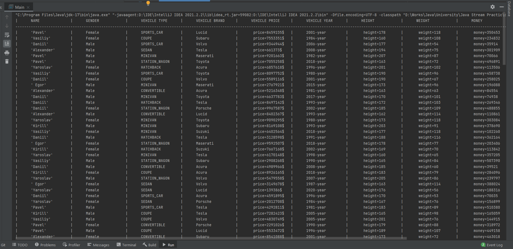
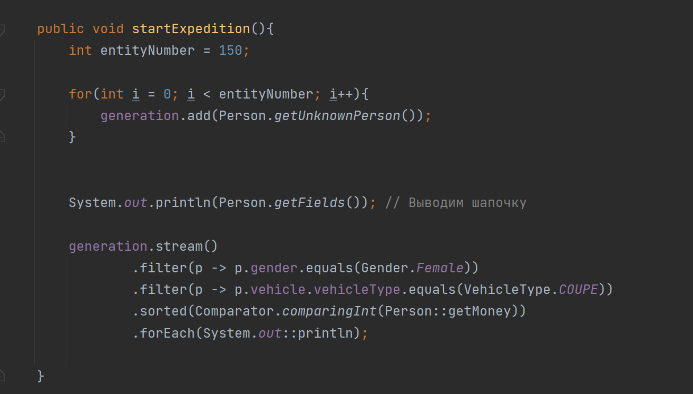
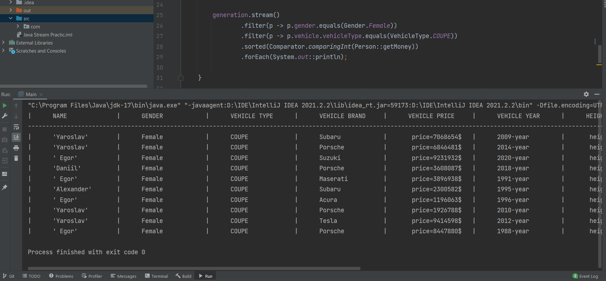

# Stream-API-DataBase

This program was created to practice Stream API in Java.

There is an abstract Person object.

### Person has
  - Name
  - Gender
  - Vehicle
      - Type
      - Brand
      - Price
      - Year
  - Height
  - Weight
  - Money
  ---
  
Person is needed in order to practice filtering.

You can make as many random objects of this class as you like.

#### An example of Person output

#### As you can see, there is output formatting.

Everything happens in the `LearningZone` class in the `startExpedition` method.

Here you can do whatever you want with the `generation` ArrayList.

#### An expamle of this output

---

### Of course, you can extend Person and add your fields for more practice.
### I hope, that this project will helps someone to skip preparing routine to Stream API practice.
